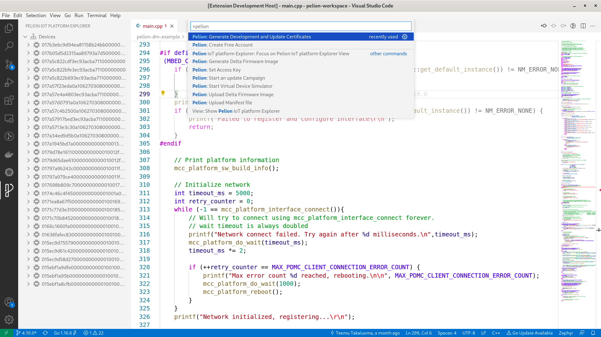

# pelion-iot-tools

An extension to allow interacting with [Pelion IoT platform](https://pelion.com/) using Visual Studio Code

Open [Pelion Zephyr reference example](https://developer.pelion.com/docs/device-management/current/connecting/zephyr.html) when the extension is activated for testing. Also refer to Zephyr [Getting Started Guide](https://docs.zephyrproject.org/latest/getting_started/index.html) and [Application Development](https://docs.zephyrproject.org/latest/application/index.html) page for more information on Zephyr build system.

> NOTE: Work in progress

## Running locally

* Run `npm install` in terminal to install dependencies
* Open the project in VSCode
* Press `F5` to open a new window with pelion-iot-tools extension loaded.
* Run your command from the command palette by pressing (`Ctrl+Shift+P` or `Cmd+Shift+P` on Mac) and typing `Pelion`.
* Set breakpoints in your code inside `src/extension.ts` to debug pelion-iot-tools extension.
* Find output from pelion-iot-tools extension in the debug console.

## Make changes

* You can relaunch the extension from the debug toolbar after changing code in `src/extension.ts`.
* You can also reload (`Ctrl+R` or `Cmd+R` on Mac) the VS Code window with pelion-iot-tools extension to load your changes.

## Explore the API

* You can open the full set of our API when you open the file `node_modules/@types/vscode/index.d.ts`.

## Run tests

* Open the debug viewlet (`Ctrl+Shift+D` or `Cmd+Shift+D` on Mac) and from the launch configuration dropdown pick `Extension Tests`.
* Press `F5` to run the tests in a new window with pelion-iot-tools extension loaded.
* See the output of the test result in the debug console.
* Make changes to `src/test/suite/extension.test.ts` or create new test files inside the `test/suite` folder.
  * The provided test runner will only consider files matching the name pattern `**.test.ts`.
  * You can create folders inside the `test` folder to structure your tests any way you want.
